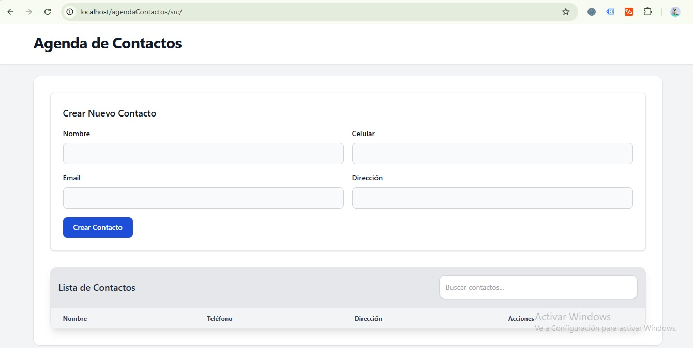

# Agenda de Contactos
Una aplicación web simple para gestionar contactos personales, desarrollada con PHP siguiendo el patrón MVC.
## Características
- Crear, leer, actualizar y eliminar contactos
- Búsqueda de contactos por nombre, teléfono o email
- Interfaz responsiva y amigable
- Validación de formularios en cliente y servidor
- Diseño basado en MVC (Modelo-Vista-Controlador)

## Requisitos Previos

1. XAMPP (incluye Apache, MySQL, PHP)
   - Descarga: https://www.apachefriends.org/download.html
   - Versión mínima recomendada: 8.0.0

## Instalación

1. *Instalar XAMPP*
   - Ejecuta el instalador y sigue los pasos
   - Selecciona al menos los componentes Apache, MySQL, PHP
   - Completa la instalación

2. *Iniciar Servicios*
   - Abre XAMPP Control Panel
   - Inicia Apache y MySQL usando los botones "Start"
   - Verifica que aparezcan en verde

3. *Crear Base de Datos*
   - Abre tu navegador
   - Ve a: http://localhost/phpmyadmin
   - Clic en "Nueva" en el panel izquierdo
   - Nombre de la base de datos: "agenda_contactos"
   - Clic en "Crear"
   - Ve a la pestaña "SQL"
   - Copia y pega el siguiente código:

sql
CREATE TABLE contacts (
    id INT AUTO_INCREMENT PRIMARY KEY,
    name VARCHAR(100) NOT NULL,
    phone VARCHAR(20) NOT NULL,
    email VARCHAR(100),
    address TEXT,
    created_at TIMESTAMP DEFAULT CURRENT_TIMESTAMP,
    updated_at TIMESTAMP DEFAULT CURRENT_TIMESTAMP ON UPDATE CURRENT_TIMESTAMP
);

4. *Instalar la Aplicación*
   - Ve a la carpeta: C:\xampp\htdocs
   - Crea una carpeta llamada "agenda"
   - Copia todos los archivos del proyecto en esa carpeta

5. *Configurar la Conexión*
   - Abre config/database.php
   - Verifica que los datos coincidan con tu instalación:

    Ejemplo 
    private $host = "localhost"
    private $database = "agenda_contactos";
    private $username = "root";
    private $password = "";

6. *Abre tu navegador y ve a: http://localhost/agenda*

   - Ver todos los contactos
   - Crear nuevo contacto
   - Buscar contactos
   - Editar contactos existentes
   - Eliminar contactos

## Captura de pantalla

